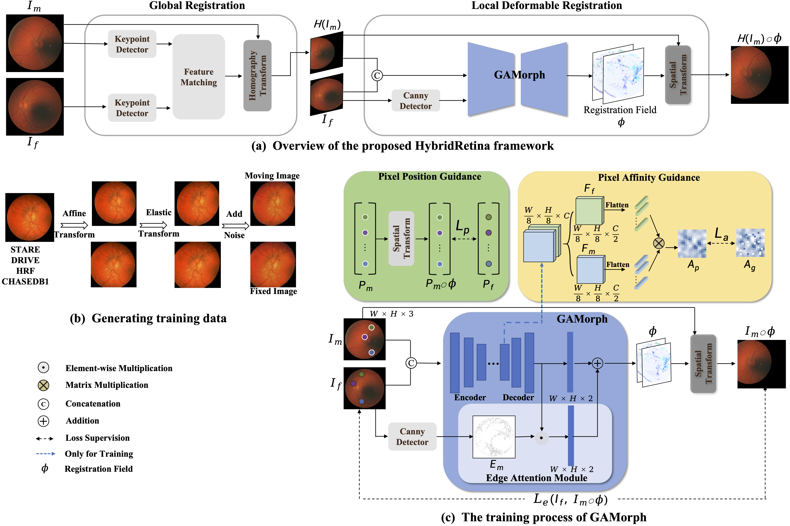

# awesome-retinal-registration
about mono-modal / multi-modal retinal image registration

# MOS-Multi-Task-Face-Detect
<div align="center"></div>


## Introduction
This repo is the official implementation of "Progressive Retinal Image Registration via Global and Local Deformable Transformations ". The paper has been accepted at BIBM2024.

This repo is an implementation of PyTorch. MOS is a low latency and lightweight architecture for face detection, facial landmark localization and head pose estimation.It aims to bridge the gap between research and industrial communities.
For more details, please refer to our [report on Arxiv](https://arxiv.org/abs/2110.10953).

## Updates
* 【2021/9/3 We have released the code of our GAMorph.
* 【2021/9/2 We have released our paper on [Arxiv](https://arxiv.org/abs/2110.10953).
* 【2024/8/16】 "Progressive Retinal Image Registration via Global and Local Deformable Transformations " has been accepted at BIBM2024.

## Comming soon


## Benchmark
<!--  -->

#### Light Models.


| Model               | MAUC-S | MAUC-P | MAUC-A | MAUC | RMSE |
|---------------------|:------:|:------:|:------:|:----:|:----:|
| SuperRetina         |  94.7  |  54.0  |  78.3  | 75.7 |  5.2 |
| SuperRetina + GAMorph|  94.0  |  65.9  |  80.6  | 80.2 |  4.5 |

## Quick Start


<summary>Installation</summary>

Step1. Install awesome-retina.
```shell
git https://github.com/lyp-deeplearning/awesome-retinal-registration.git
cd awesome-retinal-registration
conda create -n awe-retina python=3.8.5
conda activate awe-retina
```

Step2. Run Pytorch inference demo.
```shell
## run the MOS-M model 
python test_matching_accruacy.py 

```

## Cite MOS
If you use MOS in your research, please cite our work by using the following BibTeX entry:

```latex
...
```
